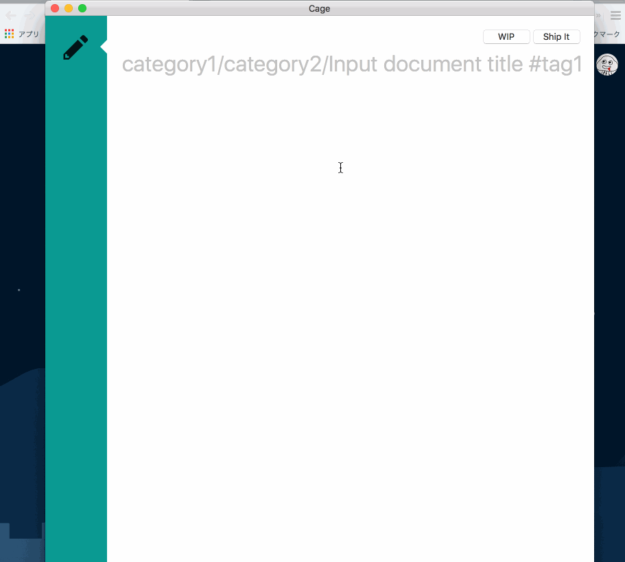

# Cage
Native OSX Application for https://esa.io

# Usage
- [https://[team name].esa.io/user/tokens/new](https://[team name].esa.io/user/tokens/new) よりtokenを生成(Read/Write)し、設定でチーム名と一緒に保存
- エディタ画面からWIP/Ship It できるようになります。
